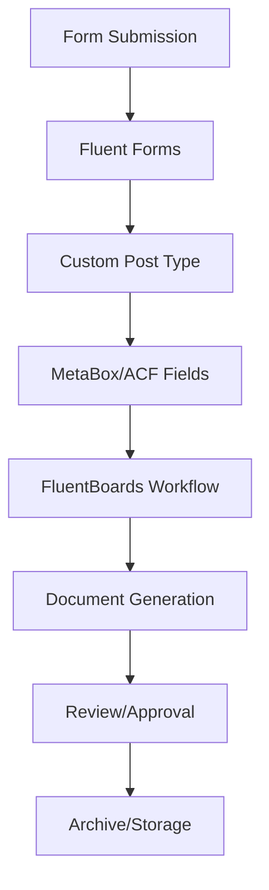

# PiperPrivacy - Technical Architecture

## Technology Stack

### Core Framework
- WordPress 6.0+
- PHP 8.0+
- MySQL 5.7+ / MariaDB 10.3+

### Key Dependencies
1. **Data Management**
   - MetaBox Pro (Custom fields framework)
   - Advanced Custom Fields PRO (Additional field types)
   - MetaBox AIO (All-in-one extension pack)
   - MetaBox - FrontEnd Submission

2. **Form Management**
   - Fluent Forms Pro
   - Fluent Forms PDF
   - Fluent Forms API Integrations

3. **UI/UX Framework**
   - Bricks Builder (Visual Website Builder)
   - Automatic CSS (ACSS) for dynamic styling
   - TailwindCSS (For custom components)
   - CSS Custom Properties for theming

4. **Workflow Management**
   - FluentBoards
   - FluentCRM (For notifications)
   - WP Cron Manager (For scheduled tasks)

## Plugin Architecture

### 1. Custom Post Types

```php
- privacy-collection
  - Collection basic information
  - Status tracking
  - Version control
  
- privacy-threshold
  - PTA form data
  - Risk assessments
  - Approvals
  
- privacy-impact
  - PIA documentation
  - Impact assessments
  - Stakeholder reviews
  
- privacy-document
  - Generated documents
  - Attachments
  - Version history
  
- privacy-workflow
  - Process definitions
  - Stage tracking
  - Assignments
```

### 2. MetaBox Field Groups

```php
- collection-details
  - Purpose statement
  - Legal authorities
  - Data elements
  - System information
  
- threshold-analysis
  - PII identification
  - Risk factors
  - Privacy controls
  
- impact-assessment
  - System analysis
  - Data flows
  - Security measures
  - Access controls
  
- workflow-status
  - Current stage
  - Assigned users
  - Due dates
  - Action history
```

### 3. Fluent Forms Integration

#### Multi-step Forms
1. Collection Information Form
   - Basic details
   - Purpose
   - Authority
   - Data elements

2. Privacy Threshold Analysis
   - PII identification
   - Initial risk assessment
   - Controls assessment
   
3. Privacy Impact Assessment
   - Detailed analysis
   - Risk assessment
   - Mitigation measures
   
#### Form Features
- Conditional logic
- Dynamic field population
- Save and resume
- PDF generation
- Email notifications
- API integration

### 4. FluentBoards Workflow

#### Lifecycle Stages
1. Collection Planning
   - Initial documentation
   - Stakeholder identification
   
2. Threshold Analysis
   - PTA completion
   - Risk review
   - Approval workflow
   
3. Impact Assessment
   - PIA development
   - Stakeholder review
   - Final approval
   
4. Implementation
   - Collection active
   - Monitoring
   - Regular reviews
   
5. Retirement
   - Closure documentation
   - Archive process
   - Data disposition

### 5. Integration Architecture

```php
- Core Plugin
  ├── includes/
  │   ├── class-privacy-collection.php
  │   ├── class-threshold-analysis.php
  │   ├── class-impact-assessment.php
  │   ├── class-workflow-manager.php
  │   └── class-document-generator.php
  │
  ├── admin/
  │   ├── class-admin-menu.php
  │   ├── class-settings.php
  │   └── views/
  │
  ├── public/
  │   ├── class-public-forms.php
  │   ├── class-public-display.php
  │   └── views/
  │
  ├── integrations/
  │   ├── class-metabox-integration.php
  │   ├── class-acf-integration.php
  │   ├── class-fluentforms-integration.php
  │   └── class-fluentboards-integration.php
  │
  └── assets/
      ├── css/
      ├── js/
      └── images/
```

### 6. Data Flow Architecture



## Frontend Architecture

### 1. Automatic CSS (ACSS) Implementation
- Dynamic CSS generation based on component usage
- Just-in-time CSS compilation
- Style extraction from Bricks Builder components
- Optimization features:
  - Unused CSS removal
  - Style deduplication
  - CSS minification
  - Critical CSS extraction
- Integration with WordPress enqueue system
- Cache management for generated styles
- Development mode with source maps

### 2. Bricks Builder Integration
- Custom Bricks elements for privacy forms
- Dynamic data integration
- Conditional rendering
- Responsive design system
- Custom element registration
- Template system for privacy documents

### 3. Component Architecture
- Reusable privacy form components
- Document template components
- Workflow status displays
- Dashboard widgets
- Review interfaces
- Approval workflows

## Security Implementation

### 1. Data Protection
- WordPress nonce verification
- Input sanitization
- Output escaping
- Prepared SQL statements
- Encryption at rest
- Secure file handling

### 2. Access Control
- Role-based permissions
- Capability checking
- Form access control
- Document access restrictions
- Audit logging

### 3. API Security
- API authentication
- Rate limiting
- Request validation
- Response sanitization
- Error handling

## Performance Optimization

### 1. Database
- Optimized queries
- Proper indexing
- Caching strategy
- Transaction handling

### 2. Assets
- CSS/JS minification
- Lazy loading
- Image optimization
- Cache management

### 3. Forms
- Progressive loading
- AJAX submissions
- Partial saves
- Background processing

## Development Guidelines

### 1. Coding Standards
- WordPress Coding Standards
- PHP PSR-12
- JavaScript Standard Style
- CSS/SCSS Guidelines

### 2. Documentation
- PHPDoc blocks
- Inline comments
- README files
- API documentation
- User documentation

### 3. Testing
- Unit testing (PHPUnit)
- Integration testing
- Accessibility testing
- Performance testing
- Security testing
