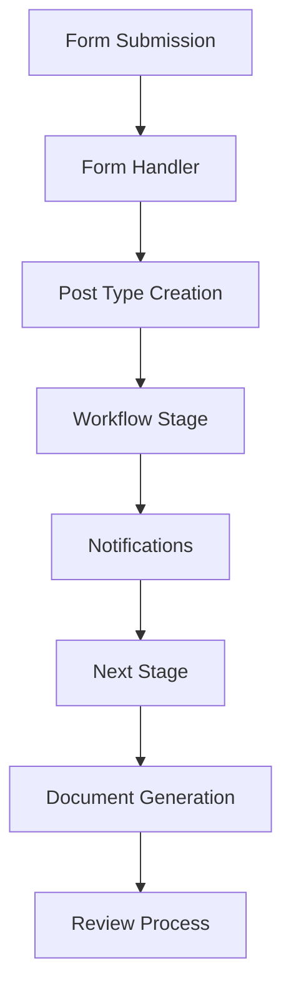

# PiperPrivacy - Technical Architecture

## Technology Stack

### Core Framework
- WordPress 6.0+
- PHP 8.0+
- MySQL 5.7+ / MariaDB 10.3+

### Key Dependencies
1. **Data Management**
   - MetaBox Pro (Custom fields framework)
$date = pp_get_field('review_date');
$validation = pp_validate_date_field($date, [
    'format' => 'Y-m-d',
    'min_date' => '2024-01-01',
    'max_date' => '2025-12-31'
]);   - MetaBox AIO (All-in-one extension pack)
   - MetaBox - FrontEnd Submission

2. **Form Management**
   - Fluent Forms Pro
   - Fluent Forms PDF
   - Fluent Forms API Integrations

3. **UI/UX Framework**
   - Bricks Builder (Visual Website Builder)
   - Automatic CSS (ACSS) for dynamic styling
   - CSS Custom Properties for theming
   - BEM CSS naming

4. **Workflow Management**
   - FluentBoards
   - FluentCRM (For notifications)
   - WP Cron Manager (For scheduled tasks)

## Plugin Architecture

### 1. Custom Post Types
```php
- privacy-collection
  - Collection basic information
  - Status tracking
  - Version control
  
- privacy-threshold
  - PTA form data
  - Risk assessments
  - Approvals
  
- privacy-impact
  - PIA documentation
  - Impact assessments
  - Stakeholder reviews
```

### 2. Forms System
```php
- BaseForm
  - Core form functionality
  - Data validation
  - Submission handling
  - Meta storage

- CollectionForm
  - Privacy collection details
  - System information
  - Data elements

- PrivacyThresholdForm
  - PII assessment
  - Risk evaluation
  - Controls documentation

- PrivacyImpactForm
  - System analysis
  - Data flow mapping
  - Risk assessment
  - Mitigation planning
```

### 3. Workflow System
```php
- BaseWorkflow
  - Stage management
  - Status transitions
  - Notification handling
  - Action processing

- CollectionWorkflow
  - 12-stage lifecycle
  - Automated transitions
  - Document generation
  - Review scheduling
  
Stages:
1. Draft
2. PTA Required
3. PTA In Progress
4. PTA Review
5. PIA Required
6. PIA In Progress
7. PIA Review
8. Implementation
9. Active
10. Under Review
11. Retirement
12. Archived
13. Post-Implementation Review
14. Compliance Check
15. Final Approval
16. Closed
```

### 4. Integration Architecture
```php
- Core Plugin
  ├── includes/
  │   ├── Core/
  │   │   └── Plugin.php
  │   ├── modules/
  │   │   └── collection-manager/
  │   │       ├── PostTypes/
  │   │       ├── Forms/
  │   │       └── Workflow/
  │   └── integrations/
  ├── admin/
  ├── public/
  └── assets/
```

### 5. Data Flow


## Security Implementation

### 1. Data Protection
- WordPress nonce verification
- Input sanitization
- Output escaping
- Prepared SQL statements
- Encryption at rest
- Secure file handling

### 2. Access Control
- Role-based permissions
- Capability checking
- Form access control
- Document access restrictions
- Audit logging

### 3. API Security
- API authentication
- Rate limiting
- Request validation
- Response sanitization
- Error handling

## Performance Optimization

### 1. Database
- Optimized queries
- Proper indexing
- Caching strategy
- Transaction handling

### 2. Assets
- CSS/JS minification
- Lazy loading
- Image optimization
- Cache management

### 3. Forms
- Progressive loading
- AJAX submissions
- Partial saves
- Background processing

## Development Guidelines

### 1. Coding Standards
- WordPress Coding Standards
- PHP PSR-12
- JavaScript Standard Style
- CSS/SCSS Guidelines

### 2. Documentation
- PHPDoc blocks
- Inline comments
- README files
- API documentation
- User documentation

### 3. Testing
- Unit testing (PHPUnit)
- Integration testing
- Accessibility testing
- Performance testing
- Security testing