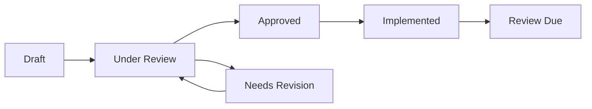

# PiperPrivacy

[](https://www.gnu.org/licenses/old-licenses/gpl-2.0.en.html)
[](https://php.net)
[](https://wordpress.org)

> A comprehensive WordPress plugin for managing privacy assessments and data collection documentation.


## About PiperPrivacy

PiperPrivacy is a product of Varry LLC, specializing in privacy compliance and automation solutions for organizations handling sensitive data. Our Privacy Management Suite streamlines the process of creating, managing, and maintaining privacy documentation, including Privacy Impact Assessments (PIAs), Data Protection Impact Assessments (DPIAs), and privacy threshold analyses.

### Company Information

- **Company**: Varry LLC DBA PiperPrivacy
- **Leadership**: Trevor Lowing, Chief Information Officer
- **Focus**: Privacy Compliance Automation
- **Target Market**: Organizations with complex privacy compliance needs
- **Specialization**: Privacy Assessment Automation and Documentation
- **Compliance Frameworks**: GDPR, CCPA, HIPAA, Privacy Act, and other privacy regulations

### Key Differentiators

- **Comprehensive Workflow**: End-to-end privacy assessment and documentation management
- **Regulatory Alignment**: Built-in templates and workflows aligned with major privacy regulations
- **Integration Ready**: Works seamlessly with existing WordPress infrastructure
- **Accessibility Focus**: WCAG 2.1 compliant interface for universal access
- **Enterprise Support**: Dedicated support for enterprise customers

## Privacy Management Workflow

PiperPrivacy implements a structured workflow for managing privacy compliance:

### 1. Privacy Threshold Assessment (PTA)

The initial stage for any new project or data processing activity:

1. **Project Information**
   - Basic project details
   - Business objectives
   - Timeline and scope

2. **Initial Screening**
   - Personal data processing check
   - Special categories assessment
   - Volume and scale evaluation

3. **Risk Indicators**
   - Automated processing check
   - Cross-border transfers
   - Vulnerable data subjects

**Outcome**: Determines if a full Privacy Impact Assessment is required.

### 2. Data Collection Documentation (DCD)

Detailed documentation of data processing activities:

1. **Data Inventory**
   - Data categories
   - Purpose of collection
   - Legal basis for processing

2. **Data Flow Mapping**
   - Collection points
   - Storage locations
   - Data transfers
   - Retention periods

3. **Processing Activities**
   - Processing operations
   - Third-party processors
   - Technical measures

### 3. Privacy Impact Assessment (PIA)

Comprehensive privacy risk assessment:

1. **System Analysis**
   - Technical architecture
   - Data flow diagrams
   - Security measures

2. **Risk Assessment**
   - Threat identification
   - Impact analysis
   - Likelihood evaluation
   - Risk scoring

3. **Mitigation Measures**
   - Controls implementation
   - Residual risk assessment
   - Action planning

4. **Recommendations**
   - Technical measures
   - Organizational measures
   - Implementation timeline

### Workflow States

Each assessment moves through the following states:



- **Draft**: Initial creation and editing
- **Under Review**: Submitted for privacy team review
- **Needs Revision**: Returned for updates
- **Approved**: Cleared for implementation
- **Implemented**: Changes put into production
- **Review Due**: Periodic review required

### Roles and Responsibilities

1. **Project Owner**
   - Initiates assessments
   - Provides project details
   - Implements recommendations

2. **Privacy Officer**
   - Reviews assessments
   - Provides guidance
   - Approves/rejects submissions

3. **System Admin**
   - Manages user access
   - Configures workflows
   - Maintains audit logs

4. **Stakeholders**
   - Contribute domain expertise
   - Review relevant sections
   - Implement controls

## Features

### Data Collection Management
- Track data collection points
- Manage data retention policies
- Monitor data processing activities
- Automate data deletion workflows

### Privacy Impact Assessments
- Conduct Data Protection Impact Assessments (DPIA)
- Risk assessment tools
- Mitigation tracking
- Compliance documentation

### Consent Management
- User consent tracking
- Preference management
- Consent records maintenance
- Automated compliance reporting

### Breach Notification
- Incident response management
- Automated notifications
- Documentation tools
- Authority contact management

### Compliance Tracking
- Compliance monitoring
- Documentation management
- Audit logging
- Reporting tools

## Requirements

- WordPress 5.0 or higher
- PHP 8.0 or higher
- Classic Editor plugin
- Meta Box Pro plugin

## Installation

1. Download the latest release from the [releases page](https://github.com/TrevorLowing/PiperPrivacy/releases)
2. Upload to your WordPress site via the plugin uploader or FTP
3. Activate the plugin through the WordPress admin panel
4. Install and activate required plugins:
   - Classic Editor (set to "Classic Editor" mode)
   - Meta Box Pro

For detailed installation instructions, see [SETUP.md](docs/SETUP.md).

## Documentation

Our documentation is organized into several key areas:

### Getting Started
- [Quick Start Guide](docs/QUICK_START.md)
- [Setup Guide](docs/SETUP.md)
- [Configuration Guide](docs/CONFIGURATION.md)
- [Troubleshooting](docs/TROUBLESHOOTING.md)

### User Guides
- [User Manual](docs/USER_GUIDE.md)
- [Admin Guide](docs/ADMIN_GUIDE.md)
- [Developer Guide](docs/DEVELOPER_GUIDE.md)
- [API Reference](docs/API.md)

### Technical Documentation
- [Architecture Overview](docs/ARCHITECTURE.md)
- [Data Models](docs/DATA_MODELS.md)
- [Integration Guide](docs/INTEGRATION.md)
- [Security Guide](docs/SECURITY.md)

## Development

### Prerequisites
- Local WordPress development environment
- [Composer](https://getcomposer.org/) for PHP dependency management
- [Xdebug](https://xdebug.org/) for debugging (optional)

### Getting Started

1. Clone the repository:
```bash
git clone https://github.com/TrevorLowing/PiperPrivacy.git
```

2. Install dependencies:
```bash
composer install
```

For development tools including accessibility testing, please see the [Piper Privacy Development Tools](https://github.com/TrevorLowing/PiperPrivacy-dev) repository.

## Support

For support inquiries, please contact:
- Email: support@piperprivacy.com
- Website: https://piperprivacy.com/support

For security issues, please email security@piperprivacy.com

## License

This project is licensed under the GPL v2 License - see the [LICENSE](LICENSE.txt) file for details.
