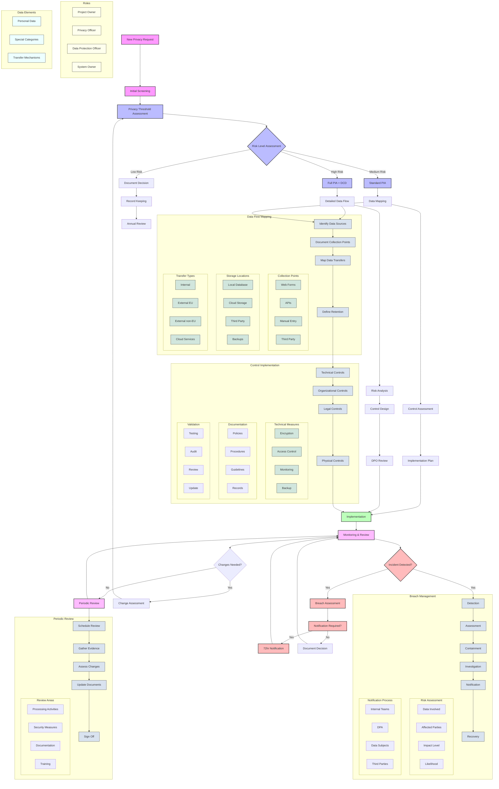

# PiperPrivacy

[](https://www.gnu.org/licenses/old-licenses/gpl-2.0.en.html)
[](https://php.net)
[](https://wordpress.org)

> A comprehensive WordPress plugin for managing privacy assessments and data collection documentation.


## About PiperPrivacy

PiperPrivacy is a product of Varry LLC, specializing in privacy compliance and automation solutions for organizations handling sensitive data. Our Privacy Management Suite streamlines the process of creating, managing, and maintaining privacy documentation, including Privacy Impact Assessments (PIAs), Data Protection Impact Assessments (DPIAs), and privacy threshold analyses.

### Company Information

- **Company**: Varry LLC DBA PiperPrivacy
- **Leadership**: Trevor Lowing, Chief Information Officer
- **Focus**: Privacy Compliance Automation
- **Target Market**: Organizations with complex privacy compliance needs
- **Specialization**: Privacy Assessment Automation and Documentation
- **Compliance Frameworks**: GDPR, CCPA, HIPAA, Privacy Act, and other privacy regulations

### Key Differentiators

- **Comprehensive Workflow**: End-to-end privacy assessment and documentation management
- **Regulatory Alignment**: Built-in templates and workflows aligned with major privacy regulations
- **Integration Ready**: Works seamlessly with existing WordPress infrastructure
- **Accessibility Focus**: WCAG 2.1 compliant interface for universal access
- **Enterprise Support**: Dedicated support for enterprise customers

## 🔄 Privacy Management Workflow

PiperPrivacy implements a structured workflow for managing privacy compliance. The system follows a comprehensive privacy lifecycle:



### Privacy Lifecycle Roles

1. **Project Owner**
   - Initiates privacy requests
   - Provides project details
   - Implements controls
   - Maintains documentation

2. **Privacy Officer**
   - Reviews assessments
   - Validates risk levels
   - Approves controls
   - Monitors compliance

3. **Data Protection Officer**
   - Reviews high-risk processing
   - Provides expert guidance
   - Handles breach notifications
   - Ensures regulatory compliance

4. **System Owner**
   - Implements technical controls
   - Maintains system documentation
   - Monitors system changes
   - Reports security incidents

### Data Processing Elements

1. **Personal Data Categories**
   - Basic personal information
   - Contact details
   - Online identifiers
   - Location data

2. **Special Categories**
   - Health data
   - Biometric data
   - Genetic data
   - Criminal records

3. **Transfer Mechanisms**
   - Standard contractual clauses
   - Binding corporate rules
   - Adequacy decisions
   - Specific derogations

## Features

### Data Collection Management
- Track data collection points
- Manage data retention policies
- Monitor data processing activities
- Automate data deletion workflows

### Privacy Impact Assessments
- Conduct Data Protection Impact Assessments (DPIA)
- Risk assessment tools
- Mitigation tracking
- Compliance documentation

### Consent Management
- User consent tracking
- Preference management
- Consent records maintenance
- Automated compliance reporting

### Breach Notification
- Incident response management
- Automated notifications
- Documentation tools
- Authority contact management

### Compliance Tracking
- Compliance monitoring
- Documentation management
- Audit logging
- Reporting tools

## Requirements

- WordPress 5.0 or higher
- PHP 8.0 or higher
- Classic Editor plugin
- Meta Box Pro plugin

## Installation

1. Download the latest release from the [releases page](https://github.com/TrevorLowing/PiperPrivacy/releases)
2. Upload to your WordPress site via the plugin uploader or FTP
3. Activate the plugin through the WordPress admin panel
4. Install and activate required plugins:
   - Classic Editor (set to "Classic Editor" mode)
   - Meta Box Pro

For detailed installation instructions, see [SETUP.md](docs/SETUP.md).

## 📚 Documentation

Our documentation is organized into several key areas:

### Getting Started
- [Setup Guide](docs/SETUP.md) - Complete installation and configuration
- [Contributing Guide](docs/CONTRIBUTING.md) - Guidelines for contributors
- [Coding Conventions](docs/coding-conventions.md) - Code style and standards

### Technical Documentation
- [Technical Architecture](docs/technical-architecture.md) - System design and components
- [API Documentation](docs/API.md) - REST API endpoints and usage
- [Development Notes](docs/development-notes.md) - Important development information
- [Project Status](docs/project-status.md) - Current development status and roadmap

### Requirements and Specifications
- [Privacy Collection Requirements](docs/privacy-collection-requirements.md) - Detailed requirements for privacy data collection

For additional documentation, please visit our [documentation portal](https://piperprivacy.com/docs).

## Development

### Prerequisites
- Local WordPress development environment
- [Composer](https://getcomposer.org/) for PHP dependency management
- [Xdebug](https://xdebug.org/) for debugging (optional)

### Getting Started

1. Clone the repository:
```bash
git clone https://github.com/TrevorLowing/PiperPrivacy.git
```

2. Install dependencies:
```bash
composer install
```

For development tools including accessibility testing, please see the [Piper Privacy Development Tools](https://github.com/TrevorLowing/PiperPrivacy-dev) repository.

## Support

For support inquiries, please contact:
- Email: support@piperprivacy.com
- Website: https://piperprivacy.com/support

For security issues, please email security@piperprivacy.com

## License

This project is licensed under the GPL v2 License - see the [LICENSE](LICENSE.txt) file for details.

### Detailed Process Documentation

#### 📊 Data Flow Mapping Process

> 📚 **Related Documentation**
> - Technical Implementation: [Data Flow Architecture](docs/technical-architecture.md#data-flow)
> - API Integration: [API Documentation](docs/API.md#data-collection)
> - Development Guide: [Development Notes](docs/development-notes.md#data-mapping)
> - Requirements: [Privacy Collection Requirements](docs/privacy-collection-requirements.md#data-sources)

The data flow mapping process ensures comprehensive documentation of all personal data processing activities:

1. **Identify Data Sources**
   - Survey all business processes
   - Document input channels
   - Map data categories
   - Identify data controllers/processors

2. **Document Collection Points**
   - **Web Forms**
     - Contact forms
     - Registration pages
     - Newsletter signups
     - Customer surveys
   
   - **APIs**
     - Third-party integrations
     - Service connections
     - Data exchange endpoints
     - Webhook configurations
   
   - **Manual Entry**
     - Customer service inputs
     - Internal forms
     - Offline collection
     - Legacy data migration
   
   - **Third Party**
     - Vendor integrations
     - Partner data sharing
     - Public databases
     - Purchased datasets

3. **Storage Locations**
   - **Local Database**
     - Primary data storage
     - Temporary caches
     - Audit logs
     - Configuration data
   
   - **Cloud Storage**
     - Distributed systems
     - Backup storage
     - Archive systems
     - CDN caches
   
   - **Third Party**
     - SaaS providers
     - Analytics platforms
     - CRM systems
     - Payment processors

4. **Transfer Types**
   - **Internal**
     - Inter-department sharing
     - Cross-system transfers
     - Process automation
     - Reporting systems
   
   - **External EU**
     - EU vendor transfers
     - Partner sharing
     - Customer data access
     - Regulatory reporting
   
   - **External non-EU**
     - International transfers
     - SCCs implementation
     - Adequacy mechanisms
     - Transfer impact assessments

#### 🛡️ Control Implementation Process

> 📚 **Related Documentation**
> - Security Controls: [Technical Architecture](docs/technical-architecture.md#security-controls)
> - Implementation Guide: [Development Notes](docs/development-notes.md#control-implementation)
> - Coding Standards: [Coding Conventions](docs/coding-conventions.md#security-practices)
> - Setup Guide: [SETUP.md](docs/SETUP.md#security-configuration)

Systematic approach to implementing privacy and security controls:

1. **Technical Controls**
   - **Encryption**
     - Data at rest
     - Data in transit
     - Key management
     - Encryption standards
   
   - **Access Control**
     - Authentication methods
     - Authorization levels
     - Session management
     - Audit logging
   
   - **Monitoring**
     - Activity logging
     - Intrusion detection
     - Performance metrics
     - Compliance checking
   
   - **Backup**
     - Backup scheduling
     - Retention policies
     - Recovery testing
     - Secure storage

2. **Documentation Requirements**
   - **Policies**
     - Privacy policies
     - Security policies
     - Data retention
     - Acceptable use
   
   - **Procedures**
     - Operating procedures
     - Incident response
     - Change management
     - Access requests
   
   - **Guidelines**
     - Best practices
     - Security standards
     - Implementation guides
     - Training materials

#### 🚨 Breach Management Process

> 📚 **Related Documentation**
> - Incident Response: [Technical Architecture](docs/technical-architecture.md#incident-response)
> - API Endpoints: [API Documentation](docs/API.md#incident-management)
> - Development Guide: [Development Notes](docs/development-notes.md#breach-handling)
> - Requirements: [Privacy Collection Requirements](docs/privacy-collection-requirements.md#breach-notification)

Comprehensive incident response and breach management workflow:

1. **Detection & Assessment**
   - Incident identification
   - Initial classification
   - Severity assessment
   - Impact evaluation

2. **Risk Assessment Components**
   - **Data Involved**
     - Data categories
     - Volume affected
     - Sensitivity level
     - Format/accessibility
   
   - **Affected Parties**
     - Data subjects
     - Controllers/processors
     - Third parties
     - Regulatory bodies

3. **Notification Process**
   - **Internal Teams**
     - Management notification
     - Legal consultation
     - Technical response
     - PR/Communications
   
   - **External Notifications**
     - DPA (72-hour requirement)
     - Data subjects
     - Law enforcement
     - Insurance providers

4. **Recovery & Documentation**
   - Incident containment
   - System restoration
   - Root cause analysis
   - Preventive measures

#### 📋 Periodic Review Process

> 📚 **Related Documentation**
> - Review Framework: [Technical Architecture](docs/technical-architecture.md#review-system)
> - API Integration: [API Documentation](docs/API.md#review-automation)
> - Project Status: [Project Status](docs/project-status.md#review-cycles)
> - Development Guide: [Development Notes](docs/development-notes.md#automated-reviews)

Structured approach to maintaining privacy compliance:

1. **Review Planning**
   - Schedule determination
   - Scope definition
   - Resource allocation
   - Stakeholder engagement

2. **Review Areas**
   - **Processing Activities**
     - Process changes
     - New data flows
     - Third-party updates
     - Legal basis review
   
   - **Security Measures**
     - Control effectiveness
     - Incident review
     - Risk assessment
     - Technical updates
   
   - **Documentation**
     - Policy updates
     - Procedure reviews
     - Record accuracy
     - Version control
   
   - **Training**
     - Training needs
     - Awareness programs
     - Compliance updates
     - Knowledge assessment

3. **Evidence Collection**
   - Processing records
   - Audit logs
   - Training records
   - Incident reports
   - Change documentation

4. **Update Implementation**
   - Document revisions
   - Process updates
   - Control enhancements
   - Training refreshes

### Implementation Examples

> 🔍 For detailed implementation examples and code snippets, refer to:
> - [Development Notes](docs/development-notes.md#implementation-examples)
> - [Technical Architecture](docs/technical-architecture.md#example-implementations)
> - [API Documentation](docs/API.md#example-requests)

### Workflow Integration

> 🔄 For information on integrating these processes into your workflow:
> - [Setup Guide](docs/SETUP.md#workflow-configuration)
> - [Technical Architecture](docs/technical-architecture.md#system-integration)
> - [Development Notes](docs/development-notes.md#workflow-automation)

### Troubleshooting

> ⚠️ For troubleshooting common issues in each process:
> - [Troubleshooting Guide](docs/TROUBLESHOOTING.md)
> - Technical Issues: [Development Notes](docs/development-notes.md#common-issues)
> - API Problems: [API Documentation](docs/API.md#troubleshooting)
